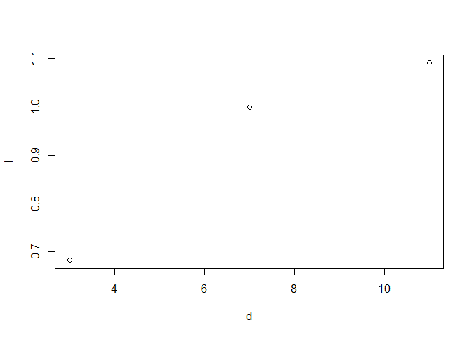

this is a line i wrote in RStudio

``` r
Vektor <- c(1,2,3)
mean <- mean(Vektor)
Sum <- sum(Vektor)
b <- c(4,5,6)
a <- c(2,4,6)
c <- c(1,3,5)
d <- a +c
f <- b + Vektor
l <- log(d, f)
plot(d, l)
```

<!-- -->
